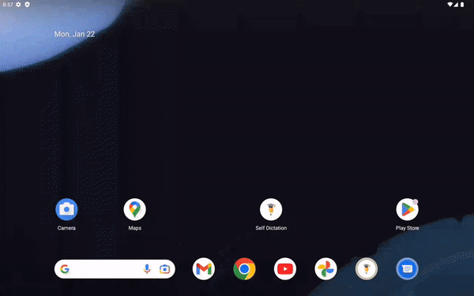

# SelfDictation

The main idea of the app is to exercise students on self-dictation. 
The application contains a screen for creating/editing and configuring sets of sentences, a screen for performing exercises (each sentence is displayed in a configured time period). Filtering of sets is supported.

### Stack: 
- [Android Studio](https://developer.android.com/studio/intro)
- Coroutines + Flow
- Arcitecture: MVVM+LiveData, Single Activity + Android Navigation
- DB: Room Persistent Library
- DI - Koin
- Lottie

## Screencast 

